# JetSpacer

> ### Project Status
>
> `JetSpacer` is becoming `Hyle`, focusing on UI & UX and major UI overhauls.
>
> As part of this transition, bookmarking support is being removed. You can check out the **`dev`** branch to see all the latest work.

---

JetSpacer pulls data from multiple NASA APIs and wraps it all in a minimal UI using Kotlin and Jetpack Compose.

### Features of `v2.0.0`
- Custom pagination for `APOD Archive`, `Mars Gallery`, and `Headlines`.
- Search APOD, Mars Rover Photos, and NASA Image Library.
- EPIC shows latest Earth imagery.
- **Bookmarking** for APOD and Mars Rover Photos.
- **Caching** support for `Headlines` with a manual clear option.
- Default API key included (or use your own: [NASA API Signup](https://api.nasa.gov/#signUp)).

### Screenshots (v2.0.0)

| 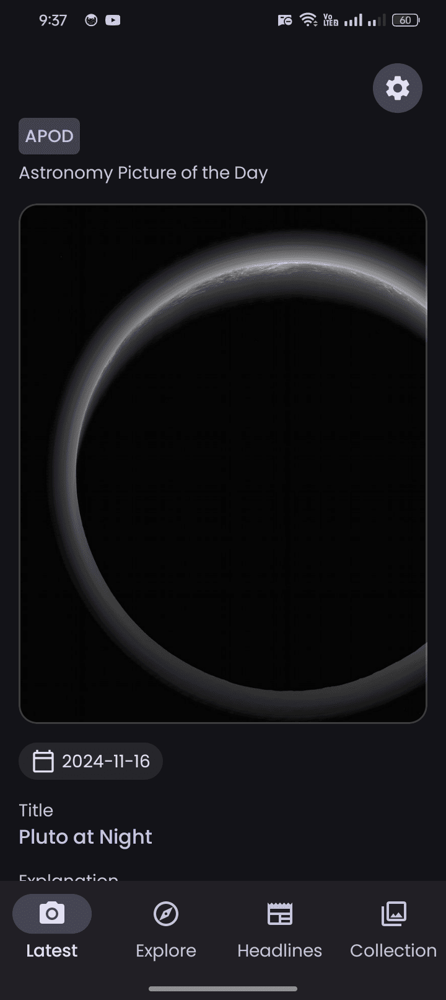 | 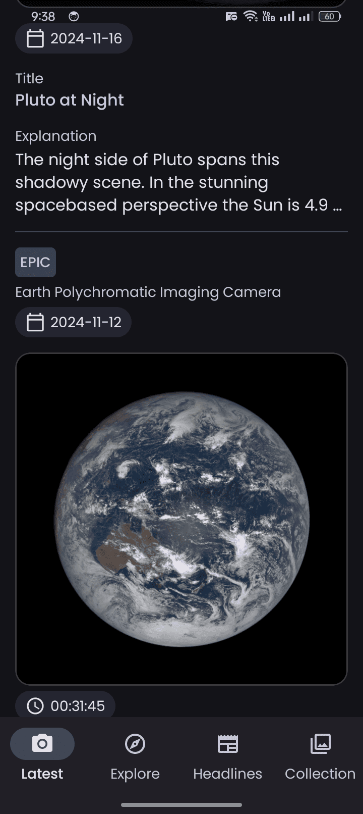   | 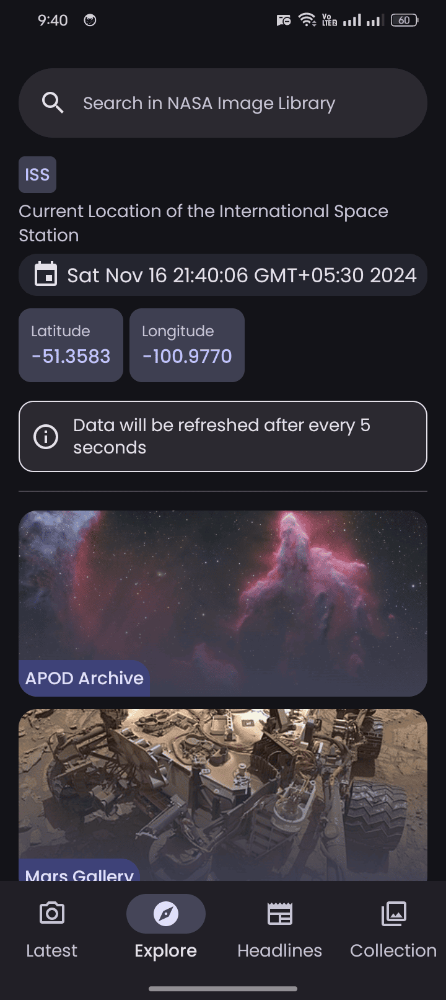   | 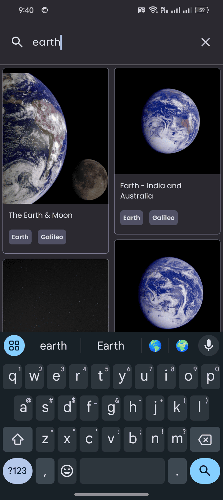   |
|--------------------------|----------------------------|----------------------------|----------------------------|
| 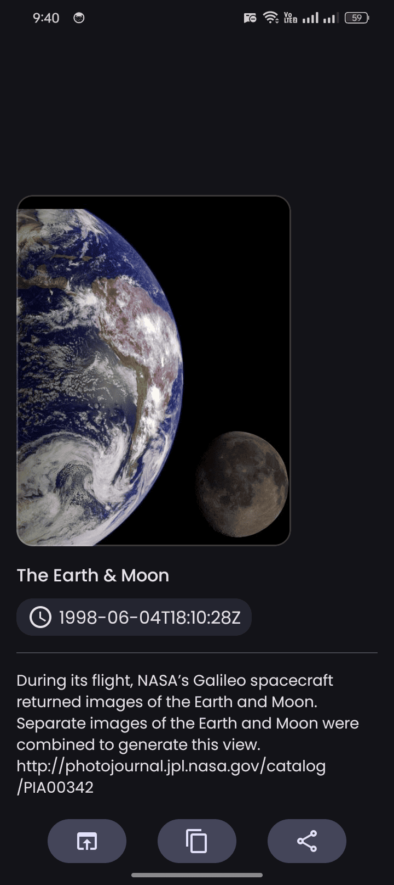 |    | 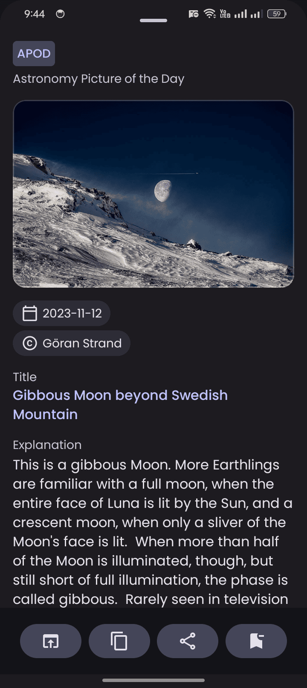   | 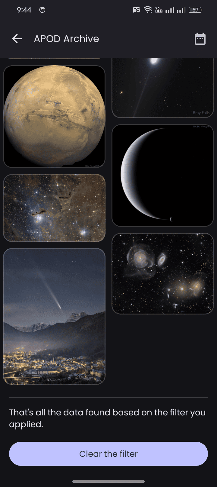   |
| 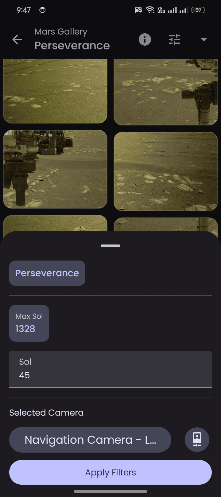 | 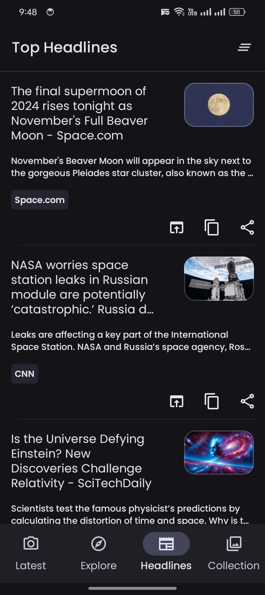 | 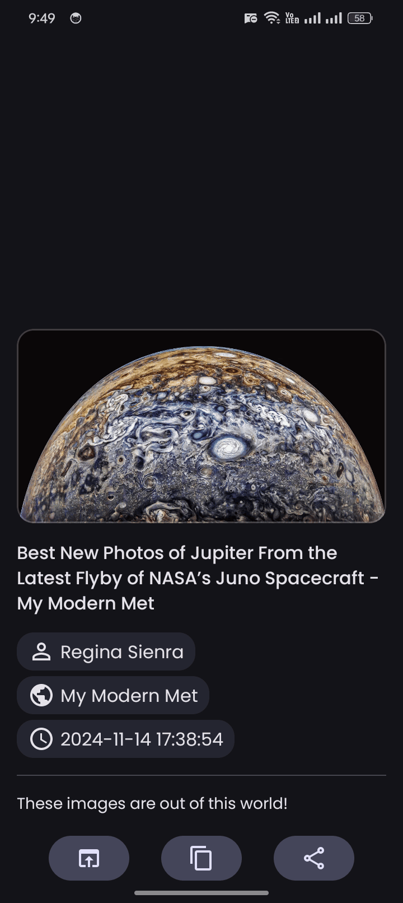 | 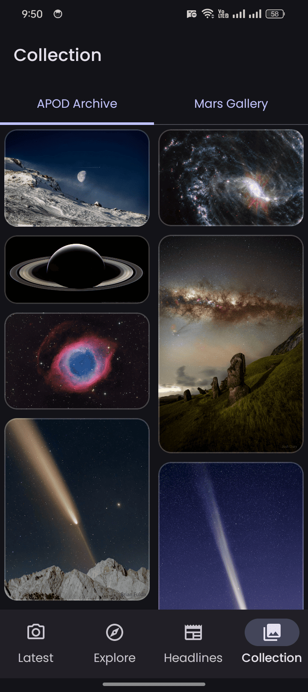 |

### License

This project is licensed under the MIT License.