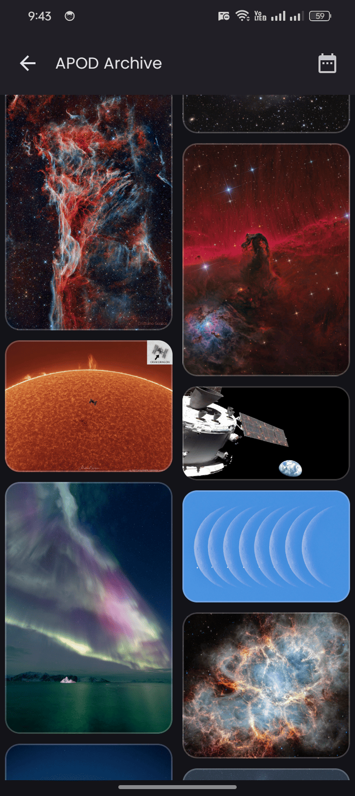

JetSpacer pulls data from multiple NASA APIs and wraps it all in a minimal UI using Kotlin and Jetpack Compose.

### Features
- Custom pagination for `APOD Archive`, `Mars Gallery`, and `Headlines`.
- Search APOD, Mars Rover Photos, and NASA Image Library.
- EPIC shows latest Earth imagery.
- Bookmarking for APOD and Mars Rover Photos.
- Caching support for `Headlines` with manual clear option.
- Default API key included (or use your own: [NASA API Signup](https://api.nasa.gov/#signUp)).

### Screenshots

|  |    |    |    |
|--------------------------|----------------------------|----------------------------|----------------------------|
|  |    |    |    |
|  |  |  |  |

---

### License

This project is licensed under the MIT License.